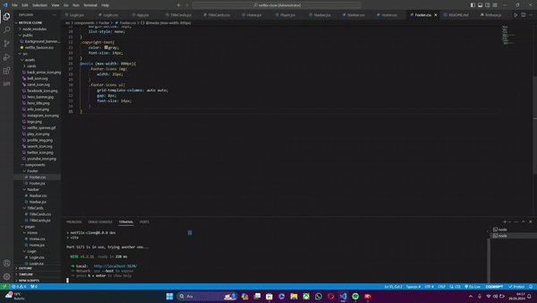

# Netflix Clone

🚀 **Excited to Share My Latest Project: Netflix Clone!** 🎬

## Features

- **Frontend:** Built using **React** for a dynamic and responsive user interface.
- **Authentication:** Implemented user authentication using **Google Firebase** for secure and efficient email sign-ups and logins.
- **Notifications:** Integrated **React Toastify** for smooth and attractive notification pop-ups.
- **Movie Data:** Utilized the **The Movie Database (TMDb) API** (https://www.themoviedb.org) to fetch and display movie information.
- **User Experience:** Focused on delivering a seamless user experience with an intuitive layout and real-time data updates.

## Preview



## Installation

1. Clone the repository:
    ```bash
    git clone https://github.com/your-username/netflix-clone.git
    ```
2. Navigate to the project directory:
    ```bash
    cd netflix-clone
    ```
3. Install the dependencies:
    ```bash
    npm install
    ```
4. Add your Firebase configuration and TMDb API key to the `.env` file:
    ```env
    REACT_APP_FIREBASE_API_KEY=your_firebase_api_key
    REACT_APP_FIREBASE_AUTH_DOMAIN=your_firebase_auth_domain
    REACT_APP_FIREBASE_PROJECT_ID=your_firebase_project_id
    REACT_APP_FIREBASE_STORAGE_BUCKET=your_firebase_storage_bucket
    REACT_APP_FIREBASE_MESSAGING_SENDER_ID=your_firebase_messaging_sender_id
    REACT_APP_FIREBASE_APP_ID=your_firebase_app_id
    REACT_APP_TMDB_API_KEY=your_tmdb_api_key
    ```
5. Start the development server:
    ```bash
    npm start
    ```

## Usage

- Visit `http://localhost:3000` in your browser to see the application in action.
- Sign up or log in using email authentication.
- Browse and search for movies, view details, and get notifications.

## Contributing

Feel free to submit issues or pull requests. Contributions are welcome!


---

Check out the code and more details on my GitHub repository!

🔗 [GitHub Project Link](https://github.com/erocode97/netflixclone)
